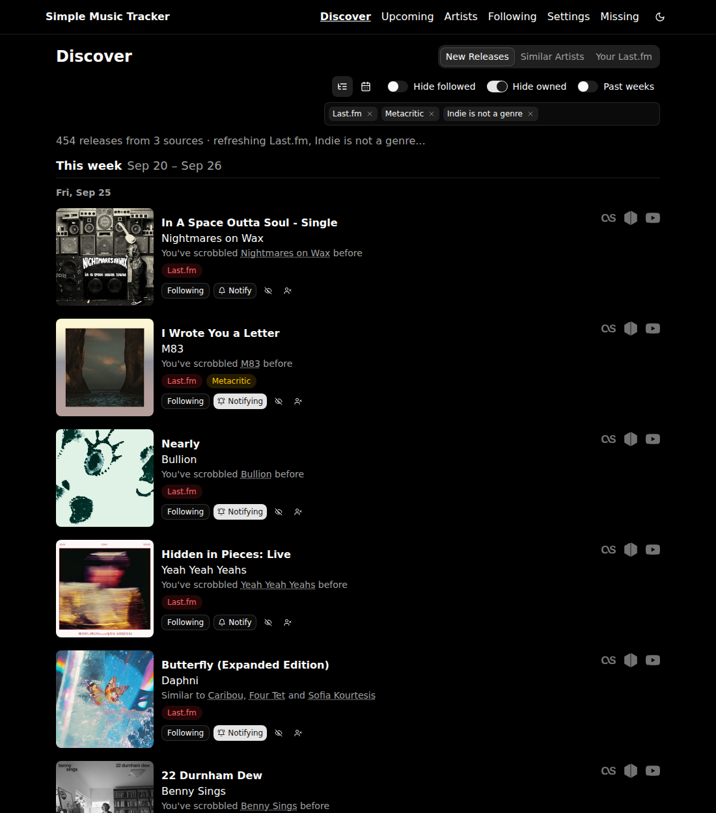

# Simple Music Tracker

A self-hosted web app that reads your music library, lists every artist in it,
and keeps track of what they release next. Follow an artist with one click;
set them to **Notify** and you're told when something new is announced. It also
finds new music you don't have, shows what's missing from your collection, and
can fetch it for you from Soulseek.

SQLite for storage, a React frontend, and plugins for everything outside the
app: libraries, discovery sources, download clients, metadata sources and
notification services. Dark (AMOLED pure black) and light themes, and installable as a PWA.



**[See screenshots of every page →](screenshots.md)**

## Features

### Your library

- **Several libraries at once.** Scan a folder of music files (mp3, flac, m4a,
  ogg, opus, wav and more), or read a **Navidrome / Subsonic** or **Plex**
  server. Each source is scanned on its own schedule, and what they own is
  combined.
- **Quick scan** for folders: after the first full scan, only files added or
  changed since the last one are read.
- **Owned albums, with quality and track count.** Discographies show what you
  have and in which format ("FLAC", "MP3 320"). Albums you own with fewer tracks
  than a complete copy are flagged as incomplete.
- **Play what you own.** Album pages stream the full track from whichever
  library has it (in the order you choose), and fall back to a 30-second preview
  from iTunes, Deezer or Last.fm for anything you don't.
- **Tidy artists.** Merge duplicates ("Beatles" and "The Beatles"); the app
  suggests likely duplicates itself. Match an artist to MusicBrainz by pasting a
  link. Ignore artists you don't care about; they're moved to an **Ignored** page
  and nothing is lost.

### Following artists

- **Two levels per artist.** *Follow* tracks their releases on the Following
  and Upcoming pages. *Notify* also sends a notification for each new release,
  either as soon as it's found or a set time before the release date.
- **Choose release types per artist:** any mix of Albums, EPs and Singles, with
  a default for new follows.
- **Full discography on demand.** An artist page lists every album, EP and
  single from MusicBrainz, marks the ones you own, and tags EPs and singles with
  how many of their songs you don't have yet.
- **Monitor artists who aren't in your library** by pasting a MusicBrainz link
  or ID.

### Upcoming releases

- An **agenda** (this week, next week, by date) and a month **calendar** of
  releases from the artists you follow.
- **Calendar feed:** subscribe to a private `.ics` link in any calendar app.
- **Get Hyped playlist:** builds a playlist on Navidrome of songs you already
  own by the artists with a release due, by hand or weekly.

### Discover

New music you don't have yet, in the same agenda and calendar views. Each source
can be switched on or off:

- **Last.fm** "coming soon" recommendations (needs your Last.fm session cookie),
  with the reason for each ("you've scrobbled…", "similar to…").
- **Metacritic** release calendar.
- **Album of the Year** upcoming releases (behind Cloudflare: paste a clearance
  cookie, or run **FlareSolverr** to solve the challenge automatically).
- **Indie Is Not A Genre** new and upcoming releases.
- **AllMusic** featured new releases each week, with ratings and Editors'
  Choices.
- **ListenBrainz** fresh releases (everything new in MusicBrainz), kept to
  artists similar to yours, tags you choose, or the picks for your
  ListenBrainz account.
- **New from your library:** new releases by artists you own but don't
  follow, from the same ListenBrainz list.
- **KEXP** radio plays: new records the station is airing and how often.
- **Hype Machine:** what music blogs are posting now.
- **Reviews and announcements** from **Pitchfork**, **Stereogum**,
  **Consequence**, **Paste**, **NME**, **DIY**, **The Quietus** and
  **BrooklynVegan** (their RSS feeds), and **AnyDecentMusic?** critic
  averages.

The sources from AllMusic down are off until you switch them on under
Settings > Discovery.
- **Similar artists**, gathered from Last.fm, and **Your Last.fm:** the
  artists you play most that aren't in your library.

Each release shows the artist's genres as tags, and has a **play button**: it
plays the release's tracks (your own copy if a library has it, else a preview),
or the artist's top tracks when nothing on the record is out yet, and the player
says so. Switch on **Continue to next artist** and it carries on down the list;
the row playing is highlighted, and releases you've already heard are skipped.
The audio for every release from this week to a month out, on Discover and
Upcoming, is **looked up in the background** ahead of time (Settings >
Discovery > Pre-load audio), so play starts at once. Every preview it finds,
and every one you play, is **saved to disk** as `data/previews/<Artist>/<Artist>
- <Title>.mp3` (all songs of each release or a set number, picked by a
slider; 5 GB by default, least recently played go first), so it keeps
playing after the catalogue's link has lapsed and the folder can be browsed in
any music player. For a Hype Machine row that's the whole song the blog posted.
While the pre-load runs, pages play only audio that's already been found and
look nothing up themselves.

Every request to an outside service -- from the background jobs, the plugins
and the pages alike -- shares one **request budget per service**, set from that
service's published limit (iTunes about 20 searches a minute, Deezer 50 per 5
seconds, MusicBrainz one a second, Last.fm five a second, gentler for scraped
sites). A service that answers "slow down" (429, 503, Retry-After, rate-limit
headers, or its own quota error) is left alone for as long as it asks, and
that answer is never stored as "not found". Your own servers (music
libraries, slskd, FlareSolverr) aren't limited.

- **For you:** sort the feed by how well each release fits you (similar to
  your artists, your Last.fm plays, the genres you collect, critic score, how
  many sources list it), with the reasons on each row. Or sort by **critic
  score** (Metascores from Metacritic's new releases).
- **Genre filter:** show only some genres, or hide some; click any genre tag
  to filter by it. A button looks up tags for the artists that have none.
- **Heard:** releases you've played are marked and dimmed, can be hidden, and
  the continue walk skips them.
- **New since your last visit:** marked on the rows, and counted on the
  Discover tab in the navigation.
- **Save for later:** bookmark a release without following the artist. The
  **Saved** tab lists them; each is announced on its release day and can be
  grabbed automatically then.
- **Weekly digest:** the week's top picks by the For you ranking, sent to your
  notifiers on a day and time you choose.

The player plays the whole list the same way on **Upcoming** and on **Similar
Artists** (their top tracks). It has a queue view, a **next artist** button,
**thumbs up** (save the release or follow the artist) and **thumbs down**
(hide the release from Discover), keyboard shortcuts (space, `n`, `p`,
shift+`N`), lock-screen and headphone controls on phones, and a sampler setting
that plays only a release's most played tracks.

### Missing and grabbing

- **Missing:** every release by your artists that no library owns, filtered by
  type, with reissues, live albums and compilations hidden by default.
- **Incomplete:** albums you own with fewer tracks than the shortest official
  edition on MusicBrainz, with a button to fetch just the missing tracks.
- **Quality profile:** which formats are acceptable, best first. Soulseek
  searches only for those.
- **One-click grab** from the Missing page or an album page, through
  **slskd** (Soulseek).
- **Automatic grabbing** (off by default) of new releases from the artists you
  choose, within a set age and batch size.
- **Duplicate protection:** nothing is sent if the library already owns it or
  the download client already has it.
- **Soulseek downloads followed to the end.** Every file of an slskd download is
  tracked. A failed file is retried, then fetched from another peer (same format
  only), and a download that still ends short searches again later. The
  **Downloads** tab shows each file and lets you retry, try another peer, or
  cancel.

### Metadata and artwork

- **Choose where information comes from.** For each field (artist photos,
  bios, genre tags, similar artists, album covers, write-ups, previews) you
  order the sources: Last.fm, Deezer, iTunes, the Cover Art Archive, and your
  own release covers.
- **Artwork kept on disk**, so pages load instantly and work offline. A review
  tool helps pick photos for artists that have none.
- **Find missing metadata** across every followed artist and fill it in from the
  sources.

### Everything else

- **Notifications** through **ntfy**, **Gotify**, **Discord** or a **custom
  webhook**, each subscribed to the events it wants: new release found, release
  day, release sent to the download client, Soulseek download finished or
  incomplete, scan finished, the weekly Discover picks, and a saved release
  coming out.
- **Search links:** add your own search sites (a tracker, a record shop, a
  wiki) with a URL like `https://example.com/torrents.php?searchstr={query}`;
  each shows as an icon, the site's own favicon or one you choose, beside every
  release's Last.fm / MusicBrainz / YouTube Music links.
- **Backup and restore** as a ZIP file (settings, artist information and
  artwork, each optional). Older JSON backups still import.
- **Maintenance:** control how long scraped data is kept, delete what belongs
  to artists you've unfollowed, and compact the database.
- **Configurable navigation:** drag the tabs into the order you want; the top
  one is your home page.
- **Scheduled tasks** listed in Settings with when each last ran and runs next.
- A **JSON API** for everything the UI does.

Only artists you **follow** are checked for new releases. At MusicBrainz's
limit of about one request a second, sweeping a library of thousands of artists
isn't practical, so tracking is scoped to the ones you chose.

## Run the pre-built image (pull from GitHub)

A GitHub Actions workflow builds a multi-arch image (`linux/amd64` +
`linux/arm64`) and publishes it to the **GitHub Container Registry** on every
push to the default branch and every `vX.Y.Z` tag. Available tags:

- `ghcr.io/jasii/simple-music-tracker:latest` - newest default-branch build
- `ghcr.io/jasii/simple-music-tracker:v1.2.3` - a specific release tag

Pull and run it directly:

```bash
docker run -d -p 8080:8080 \
  -e PUID=$(id -u) -e PGID=$(id -g) \
  -v "$(pwd)/data:/data" \
  -v "/path/to/your/music:/music:ro" \
  --name simple-music-tracker \
  ghcr.io/jasii/simple-music-tracker:latest
```

`PUID` and `PGID` (default `1000`) set the user and group the app runs as, so
the files it writes under `/data` belong to you on the host; `GUID` works as
another name for `PGID`. On start the container hands anything under `/data`
owned by someone else (an older image ran as root) over to that user. Set
`PUID=0` to run as root as before.

The music folder is optional: skip it if your library is on Navidrome or Plex,
or if you'd rather add artists by hand.

Or use the provided [`docker-compose.example.yml`](docker-compose.example.yml).
It has the music volume and an optional FlareSolverr service commented out;
uncomment what you need:

```bash
docker compose -f docker-compose.example.yml up -d
# update later:
docker compose -f docker-compose.example.yml pull
docker compose -f docker-compose.example.yml up -d
```

Then open <http://localhost:8080>.

Everything the app keeps (the database, cached images and all other caches)
lives under `/data`. Back that folder up to back up the whole app.

### Publishing your own image

The workflow at `.github/workflows/docker-publish.yml` runs automatically once
the code is on your default branch. To publish:

1. Merge to `main` (or push a tag like `v1.0.0`), or trigger it manually from the
   repo's **Actions** tab (it supports `workflow_dispatch` on any branch).
2. The first successful run creates the package under your repo's **Packages**.
   If you want anyone to pull without authenticating, open the package settings
   and set its visibility to **Public**.
3. Pulling a private package requires a GitHub token with `read:packages`:
   `echo $TOKEN | docker login ghcr.io -u <username> --password-stdin`.

No secrets are needed for publishing - the workflow uses the built-in
`GITHUB_TOKEN` with `packages: write` permission.

## Build and run with Docker (local source)

The Dockerfile builds the frontend in a Node stage and copies it into the Python
image, so there's nothing to build beforehand.

1. Edit `docker-compose.yml` and point the music volume at your library:

   ```yaml
   volumes:
     - ./data:/data
     - /path/to/your/music:/music:ro
   ```

2. Build and start:

   ```bash
   docker compose up -d --build
   ```

3. Open <http://localhost:8080>.

Or with plain Docker:

```bash
docker build -t simple-music-tracker .
docker run -d -p 8080:8080 \
  -e PUID=$(id -u) -e PGID=$(id -g) \
  -v "$(pwd)/data:/data" \
  -v "/path/to/your/music:/music:ro" \
  --name simple-music-tracker simple-music-tracker
```

## First-time setup

1. Open **Settings**:
   - **Keys & accounts:** add a **Last.fm API key** (free at
     <https://www.last.fm/api>) for bios, images and tags, and a **MusicBrainz
     contact** (email or URL), which MusicBrainz asks for in the User-Agent.
   - **Library:** switch on your sources - the music folder (defaults to
     `/music`), Navidrome / Subsonic or Plex - and scan them. Artists appear as
     they're found.
   - Optionally: slskd and a quality profile under **Downloads & quality**, and
     a service under **Notifications**.
2. Follow artists on the **Artists** page (tick **Follow**, or **Notify** to be
   told about new releases). Following fetches their releases straight away;
   after that a background job checks again on the interval you set.

To **monitor an artist that isn't in your library**, paste a MusicBrainz artist
link (e.g. `https://musicbrainz.org/artist/<mbid>`) or a raw artist ID into the
"Monitor an artist by MusicBrainz link" box on the Artists page. The artist is
looked up, added and followed immediately.

## Run locally (without Docker)

```bash
python3 -m venv .venv && source .venv/bin/activate
pip install -r requirements.txt
(cd frontend && npm ci && npm run build)          # builds into app/static/spa
SMT_DB_PATH=data/tracker.db python -m app.main    # serves the app on :8080
# or production:
gunicorn --workers 1 --threads 32 --timeout 120 --bind 0.0.0.0:8080 app.main:app
```

Use a **single worker** (with threads) so the in-process scheduler and the
scan, refresh and download state stay consistent.

For frontend development, run the backend as above and start Vite alongside it.
It serves the UI with hot reload on <http://localhost:5173> and proxies API
calls to the backend on port 8080:

```bash
cd frontend && npm run dev
```

## Plugins

Everything the app talks to is a plugin under `app/plugins/`, switched on and
configured under Settings. Adding a service means adding one file.

| Kind | Bundled |
| ---- | ------- |
| Library | Music folder, Navidrome / Subsonic, Plex |
| Discovery | Last.fm, Metacritic, Album of the Year, Indie Is Not A Genre, AllMusic, ListenBrainz, New from your library, KEXP, Hype Machine, AnyDecentMusic?, Pitchfork, Stereogum, Consequence, Paste, NME, DIY, The Quietus, BrooklynVegan |
| Metadata | Last.fm, Deezer, iTunes, Cover Art Archive, your own release covers |
| Download clients | slskd (Soulseek) |
| Notifications | ntfy, Gotify, Discord |
| Challenge solvers | FlareSolverr |
| Search links | Your own sites (Settings > Downloads & quality) |

## Notifications and webhook

A notification service (ntfy, Gotify, Discord) picks the events it wants from a
checkbox list, so one can carry release announcements while another only
reports downloads.

For **Notify** artists, the custom webhook fires once per newly discovered
release. Configure its URL, method, headers and a JSON body template under
Settings > Notifications. The body template supports these placeholders:

`{artist}` `{title}` `{release_date}` `{type}` `{image_url}`

Default payload:

```json
{
  "event": "new_release",
  "artist": "{artist}",
  "title": "{title}",
  "release_date": "{release_date}",
  "type": "{type}",
  "image": "{image_url}"
}
```

Use **Send test webhook** in Settings to check your endpoint.

## JSON API

Everything the UI does goes through the JSON API. The most useful endpoints:

| Method | Endpoint | Description |
| ------ | -------- | ----------- |
| GET  | `/api/stats` | Library counts and upcoming totals. |
| GET  | `/api/artists` | List artists. Params: `q`, `subscription` (`none\|subscribed\|notify\|following`), `ignored` (`0` hide ignored - default, `1` only ignored, `all`), `sort` (`name\|tracks\|recent`), `limit`, `offset`. |
| GET  | `/api/artists/<id>` | Artist detail with tracked releases. |
| GET  | `/api/artists/<id>/discography` | All albums/EPs/singles from MusicBrainz, with what you own. |
| POST | `/api/artists/<id>/subscription` | Body `{"state": "none\|subscribed\|notify"}` (none / Follow / Notify). |
| POST | `/api/artists/subscriptions` | Bulk: `{"ids": [...], "state": "..."}`. |
| POST | `/api/artists/add` | Monitor an artist from a MusicBrainz link/ID. Body `{"link": "https://musicbrainz.org/artist/<mbid>", "state": "subscribed\|notify", "types": ["album","ep","single"]}`. |
| POST | `/api/artists/track-by-name` | Monitor an artist by name. Body `{"name": "Artist", "state": "subscribed\|notify"}`. |
| POST | `/api/artists/<id>/monitor-types` | Set watched release types. Body `{"types": ["album","ep","single"]}`. |
| POST | `/api/artists/<id>/ignore` | Hide/unhide an artist. Body `{"ignored": true\|false}`. |
| POST | `/api/artists/<id>/mbid` | Match an artist to a MusicBrainz URL/ID. Body `{"link": "..."}`. |
| POST | `/api/artists/<id>/merge` | Merge other artists into this one. Body `{"source_ids": [...], "name": "<optional>"}`. |
| POST | `/api/artists/<id>/refresh` | Re-fetch one artist's info and releases now. |
| GET  | `/api/subscriptions` | All followed artists. |
| GET  | `/api/upcoming` | Upcoming releases. Param `window`: `day`, `week`, `next-week`, `month`, `all`. |
| GET  | `/api/upcoming/releases` | Releases in a date range. Params `from`, `to` (`YYYY-MM-DD`). |
| GET  | `/api/discover/releases` | Releases from every enabled discovery source. `?refresh=1` re-fetches. |
| GET  | `/api/album/playable` | Where each track of a release plays from. Params `artist`, `title`, `mbid`. |
| GET  | `/api/artist-top-tracks` | An artist's top tracks with audio, by name. Params `artist`, `limit` (1-10). |
| GET  | `/api/prewarm/status` · POST `/api/prewarm` | Pre-load of this month's release audio: progress, or start it (`{"stop": true}` stops). |
| GET  | `/api/search-links` | Your search sites, with their icons. |
| GET/POST/DELETE | `/api/wishlist` | Releases saved for later. POST `{"artist", "album", "mbid"?, "release_date"?, "image"?}`, DELETE `{"artist", "album"}`. |
| POST/DELETE | `/api/heard` | Mark a release as listened to, or not. Body `{"artist", "album"}`. |
| GET  | `/api/discover/unseen` | How many Discover releases are new since the last visit. |
| GET  | `/api/discover/digest` · POST `/api/discover/digest/send` | Preview the weekly digest, or send it now. |
| GET  | `/api/album` | Tracklist, cover and what you own of one release. Params `artist`, `title`, `mbid`. |
| GET  | `/api/library/missing` | Releases no library owns. Params `q`, `types`, `sort`, `limit`, `offset`. |
| GET  | `/api/library/incomplete` | Albums owned with fewer tracks than a complete copy. |
| POST | `/api/library/grab` | Grab one release through the download client. Body `{"artist", "title"}`. |
| POST | `/api/library/grab-missing` | Fetch the missing tracks of an owned album. Body `{"artist", "title", "tracks"?}`. |
| GET  | `/api/downloads` | Soulseek downloads, file by file. `?active=1` for running ones only. |
| POST | `/api/downloads/<id>/retry` · `/another-peer` · `/cancel` | Act on one download. |
| GET  | `/api/autograb/status` | What the automatic pass would grab next. |
| GET  | `/api/plugins` | Every plugin, whether it's enabled and configured, and its settings. |
| POST | `/api/plugins/library/<key>/scan` | Scan one library source. |
| POST | `/api/scan` | Scan the music folder. Body `{"quick": true}` for only added/changed files. |
| POST | `/api/refresh` | Refresh all followed artists. |
| GET/POST | `/api/settings` | Read or update settings. |
| GET  | `/api/backup` | Download a ZIP backup. `?sections=settings,artists,artwork` (default all). |
| POST | `/api/import` | Restore from a backup (multipart `file`). ZIP or legacy JSON. |
| GET  | `/calendar/<token>.ics` | The private calendar feed (the link is under Settings > Maintenance). |
| POST | `/api/webhook/test` | Fire a sample webhook. |
| GET  | `/api/health` | Health check. |

Example - albums dropping this week:

```bash
curl http://localhost:8080/api/upcoming?window=week
```

## How upcoming albums are found

For each followed artist the app:

1. Resolves the artist to a MusicBrainz ID (using an embedded
   `musicbrainz_artistid` tag if present, otherwise a name search).
2. Lists the artist's release groups of the types you watch (Albums / EPs /
   Singles) from MusicBrainz.
3. Keeps the ones whose first release date is in the future or within the last
   30 days, and stores them.
4. Links cover art from the Cover Art Archive.

## Rate limiting

- **MusicBrainz:** all refresh work goes through a **single background worker**,
  so however many artists you follow at once, requests are made one at a time.
  They're paced by a configurable minimum gap (default and floor `1000ms`, one
  request a second), carry a descriptive User-Agent, and are retried with
  exponential backoff (`300ms · 2^n`, honouring `Retry-After`) on connection
  errors and `429`/`500`/`502`/`503`/`504`. A `404` counts as "not found" and
  isn't retried.
- **Last.fm:** a 6s timeout with up to 2 retries and a small backoff.
- **Similar artists:** the library scan and the genre lookup take one artist
  at a time, a second apart.
- **Soulseek:** one slskd search at a time.

Scraped answers are stored in the database (forever by default, configurable
under Settings > Maintenance), so browsing a page a second time costs no
requests at all.

## Tech

- **Backend:** Python 3.11, Flask, SQLite (stdlib `sqlite3`), gunicorn.
  `requests` for API calls, `mutagen` for reading tags, `beautifulsoup4` and
  `curl_cffi` for scraping discovery pages, and optionally `yt-dlp` to play the
  audio of video-only previews.
- **Frontend:** React 18 + TypeScript, built with Vite. shadcn/ui components on
  Tailwind CSS v4, TanStack Query for data, and React Router. PWA via manifest +
  service worker.

## Project layout

```
app/
  main.py           Flask app: JSON API, and serves the built frontend
  db.py             SQLite schema, settings, migrations, helpers
  scheduler.py      Background jobs (refreshes, scans, grabbing, downloads)
  tracker.py        Per-artist refresh, through a single worker
  musicbrainz.py    Discographies and upcoming releases (rate-limited)
  scanner.py        Music folder scanning (mutagen)
  gaps.py           Missing / incomplete lists
  grabber.py        Sends a release to the download client
  downloads.py      Follows Soulseek downloads file by file
  quality.py        Quality profile
  metadata.py       Asks metadata sources in the order you set
  calendar_feed.py  The .ics release calendar
  ...               Playback, artwork cache, previews, playlists, maintenance
  plugins/          library, discovery, metadata, downloader,
                    notifier and solver plugins
  static/           Icons, manifest, service worker; built frontend in static/spa
frontend/
  src/pages/        One file per page (Discover, Artists, Missing, Settings, ...)
  src/components/   Shared components; ui/ holds the shadcn components
screenshots/        The images in screenshots.md
Dockerfile, docker-compose.yml, docker-compose.example.yml, requirements.txt
```

## License

[MIT](LICENSE)
